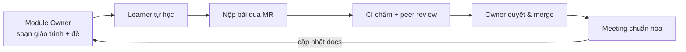

# Flutter & Dart Course — Knowledge Base

Chào mừng đến với **cổng thông tin** của khóa học Flutter/Dart nội bộ. Trang web này được build tự động từ thư mục `docs/` mỗi khi có thay đổi trên `main`.

!!! tip "Mới vào? Đọc theo thứ tự này"
    1. [Bắt đầu — khóa học vận hành thế nào](00-getting-started.md)
    2. [Lộ trình học (Roadmap)](ROADMAP.md)
    3. [Code of Conduct](CODE_OF_CONDUCT.md) & [Contributing](CONTRIBUTING.md)
    4. [Module 01 — Dart Fundamentals](curriculum/module-01-dart-fundamentals.md)

## Điều hướng nhanh

- **Giáo trình** — kiến thức đã chuẩn hóa, mỗi module một bài: [Tổng quan curriculum](curriculum/README.md)
- **Hướng dẫn thao tác** — [cài môi trường](guides/environment-setup.md), [nộp bài & chấm điểm](guides/submission-and-grading.md), [thảo luận](guides/collaboration.md)
- **Chuẩn & tham chiếu** — [coding standards](standards/coding-standards.md), [review rubric](standards/review-rubric.md), [glossary](standards/glossary.md), [FAQ](standards/faq.md)
- **Cho Maintainer/Senior** — [thiết kế tổng thể](DESIGN.md), [setup repo](guides/repo-setup-checklist.md), [phân công module](guides/module-owners.md)

## Mô hình khóa học trong 30 giây

Mọi thành viên vừa **dạy**, vừa **học**, vừa **chia sẻ**. Mỗi vòng học làm giáo trình tốt hơn cho người tiếp theo.

---

!!! note "Nguồn sự thật"
    Trang web này chỉ để **đọc cho dễ**. Mọi thay đổi nội dung vẫn đi qua Merge Request trên GitLab để được review. Xem [Contributing](CONTRIBUTING.md).
